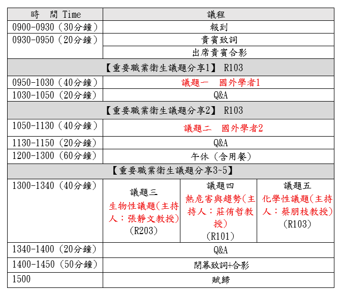

::: {.callout-warning appearance="simple"}
**本網頁排版測試中\~\~\~，內容以正式公告為準。**
:::

**指導單位：勞動部勞動及職業安全衛生研究所**

**執行單位：中國勞工安全衛生管理學會**

## **一、活動緣起**

::: {.callout-note appearance="simple"}
近年來，工作環境、氣候條件與科技發展出現劇烈轉變，職業與環境衛生安全（Occupational and Environmental Health and Safety, OEHS）領域正面臨前所未有的挑戰。為協助規劃本次職業衛生趨勢與議題研討會，參酌美國工業衛生協會（American Industrial Hygiene Association, AIHA）、英國職業衛生學會（British Occupational Hygiene Society, BOHS）及國際職業衛生協會（International Occupational Hygiene Association, IOHA）等國際專業組織近期關心議題與策略方向，規劃辦理此次研討會。

**一、氣候變遷與極端環境暴露**

全球氣溫持續升高，使戶外及高溫作業勞工（如建築、農業、製造業）面臨更高的熱傷害風險。AIHA、BOHS 及 IOHA 三大組織正加速制定更科學的熱暴露評估與預防熱危害，以因應熱壓力（Heat Stress）問題。此外，氣候變遷亦帶來新興空氣污染挑戰，包括野火產生的細懸浮微粒，以及黴菌、傳染病菌等新興生物性危害，職場暴露評估方式更需與時俱進。

**二、永續與新型化學物質危害**

在化學性危害方面，工程石材（Engineered Stone）加工所產生的游離二氧化矽暴露，已引發嚴重加速型矽肺病，英國職業衛生學會（BOHS）近期大力推動相關勞工保護與更嚴格的暴露控制。同時，新興化學品威脅如永氟烷基物質（PFAS）及阻燃劑（如 TBBPA）之危害風險評估，亦成為關注焦點。與此並行的，是新型個人防護具（如智慧 PPE）與大數據預測分析在危害控制上的應用發展。

**三、全方位勞工健康（Total Worker Health, TWH）**

由美國國家職業安全衛生研究所（NIOSH）倡導、並被美國工業衛生協會（AIHA）列為重點戰略的 Total Worker Health 概念，強調職業衛生不應僅限於傳統物理與化學危害，而須納入非傳統勞工（如零工經濟、遠距工作者）、工時過長、職場心理社會壓力，以及人因工程傷害（如 HAVS 振動骨骼肌肉疾病）等面向，實現身心一體化的全面照護。

**四、人工智慧與智慧監測**

隨著 AI、感測器技術與大數據的發展，職場危害氣體與噪音的即時監測出現新的可能性。然而，智慧防護具與 AI 工具在職場數據收集上的普及，也引發勞工隱私保護與工業衛生數據標準化（IH Data Standardization）等科技倫理議題，成為最新探討方向。

**五、新世代職業衛生戰略的整合**

國際職業衛生協會（IOHA）數據指出，全球預估需要約 44,000 名合格職業衛生師，但目前僅約 20,000 名，人才短缺問題嚴峻。因此，美國工業衛生協會（AIHA）2026 戰略與英國職業衛生學會（BOHS）2026–2030 新戰略，皆將推廣「預防第一」（Prevention-First）觀念及在新興地區建立專業能力，列為首要政策目標。

整合兩大組織的新世代職業衛生藍圖，其戰略方向高度一致，可歸納為四大核心議題：一是強化「預防第一」與科學實務落實，BOHS 將職場健康定位為核心公共議題，AIHA 則透過「知識追求」將研究轉化為良好實務原則（PGP），如熱壓力與鋰電池火災暴露指引；二是擴大專業影響力與公共政策倡議，將職業衛生從「工廠內部」推向社會公眾與政策制定；三是提升專業領導力與跨國能力建構，於新興及資源匱乏地區建立當地 OEHS 評估與防護能量；四是組織卓越、數位轉型與敏捷治理，推動前瞻治理並投資次世代資訊技術系統。整體而言，AIHA 與 BOHS 正合力將工業衛生從傳統的「危害被動檢測」，轉型為主動的公共健康政策預防，並透過智慧科技引進與全球化能力建構，保護未來更多元、更複雜的勞動群體。

**六、國內研究與發展**

職業衛生既然為國際共同關注的重要議題，隨著產業型態、工作環境及科技快速發展，職業衛生所面臨之危害與風險亦日益多元。各國政府、安全衛生機構、學術研究及實務團體持續透過國際交流與合作，分享研究成果、科技發展、勞動政策及職業災害預防經驗，以共同因應不斷變化之職業安全衛生議題。

在我國，隨著氣候變遷加劇、新興化學物質與工程石材粉塵危害浮現，以及零工經濟、遠距工作等多元勞動型態興起，職業衛生工作面臨的挑戰已與國際趨勢高度連動。借鏡美國工業衛生協會（AIHA）、英國職業衛生學會（BOHS）及國際職業衛生協會（IOHA）等組織之戰略方向，包括推廣「預防第一」觀念、強化全方位勞工健康（Total Worker Health）、導入智慧監測與 AI 技術，以及在資源匱乏地區建立專業能力等，均有助於我國掌握國際研究趨勢及發展方向，並作為政策規劃與實務推動之重要參考。

透過國際職業衛生資訊蒐集與交流，不僅可借鏡各國政策與實務經驗，亦可促進國內外研究成果及實務技術之交流，提升我國職業衛生研究與實務應用之量能。同時，藉由國際合作及專業交流，可進一步建立合作夥伴關係，分享我國相關研究與實務成果，提升我國於國際職業安全衛生領域之交流與能見度。尤其在國內面臨職業衛生專業人才培育、新興危害評估技術建構，以及事業單位落實危害預防等課題之際，強化國際鏈結與在地實踐的雙軌並進，更顯關鍵。

爰此，本次研討活動邀集職業衛生相關產、官、學、研各界專家學者，針對當前重要職業衛生議題及國際發展趨勢進行交流與研討，期藉由國內外研究成果、政策經驗及實務觀點之分享，深化各界對重要職業衛生議題之認識，並作為我國未來相關研究、政策規劃及實務推動之參考，進而踏出國際趨勢與國內實務之有效接軌的第一步。
:::

## **二、活動資訊**

::: {.callout-tip appearance="simple"}
1.  指導單位：勞動部勞動及職業安全衛生研究所

2.  執行單位：中國勞工安全衛生管理學會

3.  參加人員：勞動部勞動與職業安全衛生研究所、職業安全衛生署、各勞檢機構、事業單位職業安全衛生人員、職業安全衛生技師、作業環境監測機構人員

4.  舉辦日期、地點及名額：115年11月10日(二) 9:00－15:00

    - 地點: 福華國際文教會館 – R101\~103教室/60人

    - (臺北市大安區龍坡里新生南路三段30號1樓)

    - 報名日期：115-10-20(預計)起至115-10-25止

5.  費用及報名方式：免費，採線上報名後電子郵件通知。

6.  報名連結：[google 報名表單](https://docs.google.com/forms/d/e/1FAIpQLSdVc3K6VCUo2zdH1Dqsxn3VdvGn-kUcxiqp3BzKNRcJMXxtGQ/viewform)
:::

## **三、議程**



## **四、提醒事項**

::: {.callout-caution appearance="simple"}
1.  執行單位保有活動內容、時間、地點及相關事項之修改、變更等權利。如於活動前或活動當日遇天然災害、政府政策調整或其他不可抗力因素，執行單位得視實際情況延期、取消或終止活動。

2.  若有報名等相關疑問，請逕洽本活動執行單位中國勞工安全衛生管理學會黃先生，聯絡電話：(02)2321-1518 #52。
:::

## **五、交通資訊**

::: {.callout-important appearance="simple"}
捷運

◎ 松山新店線：捷運台電大樓站 2 號出口，步行約 10～15 分鐘。

◎ 松山新店線：捷運公館站 3 號出口，步行約 13 分鐘。

公車

◎ 龍安國小（公務人力發展學院）：52、253、280、284、290、311、505、642、643、668、671、907、0南、松江新生幹線

◎ 和平新生路口：253、280、290、311、505、642、0南
:::

```{=html}
<iframe src="https://www.google.com/maps/embed?pb=!1m18!1m12!1m3!1d57846.05293850923!2d121.50850845855001!3d25.02123249153242!2m3!1f0!2f0!3f0!3m2!1i1024!2i768!4f13.1!3m3!1m2!1s0x3442a9887ff09895%3A0xcf121b78ea5b7bfd!2z56aP6I-v5ZyL6Zqb5paH5pWZ5pyD6aSo!5e0!3m2!1szh-TW!2stw!4v1789688606902!5m2!1szh-TW!2stw" width="600" height="450" style="border:0;" allowfullscreen="" loading="lazy" referrerpolicy="strict-origin-when-cross-origin"></iframe>
```

## **六、研討會手冊[下載](會議手冊草稿(廠商參考用).pdf)**
